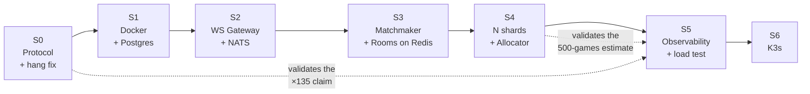
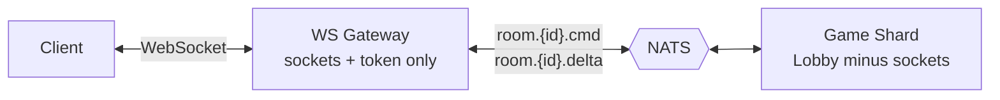

# Implementation Plan — S0 through S6

**Project:** Kung Fu Chess
**Author:** efratkamatech
**Date:** 27 July 2026
**Design rationale:** [`Server_Design_EN.md`](Server_Design_EN.md) · [`Server_Design.md`](Server_Design.md) (Hebrew)

This is the executable companion to the design document. The design says *what* and
*why*; this says *which files, in what order, and how we know a stage is done*.

---

## Contents

- [Principles](#principles)
- [Stage dependency graph](#stage-dependency-graph)
- [S0 — Protocol and correctness](#s0--protocol-and-correctness-no-new-infrastructure)
- [S1 — Containers and PostgreSQL](#s1--containers-and-postgresql)
- [S2 — Extract the WS Gateway](#s2--extract-the-ws-gateway)
- [S3 — Matchmaker and Rooms as services](#s3--matchmaker-and-rooms-as-services)
- [S4 — Many shards and the Allocator](#s4--many-shards-and-the-allocator)
- [S5 — Observability and load testing](#s5--observability-and-load-testing)
- [S6 — K3s](#s6--k3s)
- [Cross-cutting rules](#cross-cutting-rules)
- [Risk register](#risk-register)

---

## Principles

Four rules that govern every stage.

**1. Every stage ends with a running system.**
There is no stage that leaves the middle broken and hopes it resolves at the end. After
each stage you can start the server, connect two clients, and play a full game. This is
the instructors' own guidance — *something small that works beats trying to build
everything and having nothing work* — turned into a hard constraint.

**2. The thin-async-shell split survives.**
The repository's 100% coverage gate depends on two things: the async layer stays thin
enough to mark `# pragma: no cover`, and the core is synchronous, injected, and tested
with fake `send` callbacks plus an explicit `tick(dt_ms)` instead of real time. **Every
new service is built to the same pattern.** No stage is allowed to erode it.

**3. Protocol before infrastructure.**
S0 is worth a factor of 135 and needs no new services. Every infrastructure stage after
it is cheaper because of it.

**4. Constants live in `config.py`.**
Per the project's own rule — *no hardcoded constants or strings in business logic*. Every
new tunable introduced below goes there, next to the constant it relates to.

---

## Stage dependency graph



S5 is deliberately placed **before** S6: without measurement, every capacity number in
the design is a guess, and there is no point orchestrating 10,000 containers whose
capacity you have not verified.

---

## S0 — Protocol and correctness (no new infrastructure)

> **Goal:** cut per-client traffic by ~135×, cut shard CPU by ~7×, and fix a server-wide
> hang — all while still running as a single process.

**Size:** L (the largest single stage) · **New infrastructure:** none

### Why this stage is first

Measured: a full snapshot is **2,148 bytes**, broadcast **20 times per second** per
client. At 10M concurrent that is **~3.5 Tbps**. Deltas bring it to ~26 Gbps. No amount
of Kubernetes fixes this, and this needs no Kubernetes.

### S0.1 — Delta messages

**`src/kfchess/shared/protocol.py`** — add message types alongside the existing ones. The
wire format stays JSON; `encode` / `decode` are unchanged in shape.

| New message | Fields | Replaces |
|---|---|---|
| `MoveStarted` | `piece_id, token, from_sq, to_sq, start_ms, arrival_ms` | continuous position in `State` |
| `Captured` | `at_sq, victim_token, by_piece_id, at_ms` | a `cells` diff in `State` |
| `Blocked` | `piece_id, at_sq, at_ms` | a `cells` diff in `State` |
| `CooldownDone` | `at_sq, at_ms` | the `cooldown` field in `CellView` |
| `GameOver` | `winner, at_ms` | `phase` + `winner` in `State` |
| `Scored` | `color, score` | `scores` in `State` |

`State` (the full snapshot) **is kept**, with a narrower role: seating, reconnect, and a
periodic resync. `shared/snapshot.py` is unchanged.

Add to **`config.py`**:

```python
# How often a client is sent a full snapshot to correct any drift, on top of the
# per-event deltas. Lower = more traffic, faster self-correction after a lost frame.
SNAPSHOT_RESYNC_MS = 10_000
```

### S0.2 — Server: emit deltas

**`src/kfchess/server/session.py`** — `GameSession` already drains sound-kind events via
`_SOUND_KIND_BY_TOPIC`. Generalise that: the per-game `EventBus` already publishes
`move_started`, `capture`, `game_started`, `game_over`. Widen `drain_events()` into
`drain_deltas() -> List[Message]` so the same subscription produces protocol messages
rather than bare strings.

**`src/kfchess/server/lobby.py`** — `_broadcast_state` becomes:

```python
def _broadcast(self, game_id):
    members = self._members(game_id)
    for msg in self._games[game_id].session.drain_deltas():
        text = encode(msg)
        for client in members:
            client.send(text)
    self._maybe_resync(game_id, members)   # full State every SNAPSHOT_RESYNC_MS
```

**Also fix `_members` while here.** It is an O(all clients) scan run twice per game per
tick. Replace it with a maintained `dict[int, set[int]]` of game to client ids, updated
in `_seat`, `_reconnect`, and `disconnect`. This is a pure internal change with no
interface impact.

### S0.3 — Client: consume deltas

This is the largest piece of S0, and the design keeps it contained.

**Do not change the renderer.** Introduce a new class that consumes deltas and *produces*
a `GameSnapshot` on demand:

```
NetClient  ──deltas──▶  ClientGameState  ──snapshot()──▶  snapshot_view.py  (unchanged)
```

**New file: `src/kfchess/client/game_state.py`**

- Holds the last known board, the set of in-flight motions, scores, and logs.
- `apply(message)` — mutates on each delta.
- `snapshot(now_ms) -> GameSnapshot` — interpolates in-flight motions using the same
  arithmetic as `Motion.position_at`, and returns exactly the shape the renderer already
  expects.
- `reset(snapshot)` — a full `State` message replaces everything (seating, reconnect,
  resync).

Because it returns a `GameSnapshot`, **`snapshot_view.py`, the renderer, and the HUD do
not change at all.**

> **On authority:** the client interpolates between two points the server announced. That
> is arithmetic, not adjudication. Captures, legality, and game-over are still announced
> by the server and obeyed unconditionally. `GameEngine` remains the single source of
> truth.

### S0.4 — Event-driven tick

**`src/kfchess/engine/arbiter.py`** — expose the next scheduled event:

```python
def next_event_ms(self) -> Optional[int]:
    """When the earliest pending arrival or cooldown expiry is due, or None if idle."""
```

The logic already exists internally as `_earliest_arrival()`; this makes it public and
folds in cooldown expiry.

**`src/kfchess/server/game_server.py`** — `ticker()` sleeps until the earliest event
across all games rather than a fixed 50 ms, with `SERVER_TICK_MS` retained as a ceiling
so idle games still get their resync.

**Also fix the time drift here.** Pass measured elapsed time, not the nominal constant:

```python
last = time.monotonic()
while True:
    await asyncio.sleep(self._next_sleep_s())
    now = time.monotonic()
    hub.tick(int((now - last) * 1000))   # elapsed, not a hardcoded 50
    last = now
```

### S0.5 — The `RoomManager` hang

**`src/kfchess/config.py`:**

```python
# --- Rooms -------------------------------------------------------------------
# Crockford base32: 32 characters with O/0 and I/1/L removed, so a room id read aloud
# or typed from a screenshot cannot be mistyped. Six characters give ~1.07e9 ids --
# comfortably above the number of rooms that can be live at once.
ROOM_ID_ALPHABET = "0123456789ABCDEFGHJKMNPQRSTVWXYZ"
ROOM_ID_LENGTH = 6
# Give up rather than spin forever if the id space is somehow exhausted.
ROOM_ID_MAX_ATTEMPTS = 10
```

**`src/kfchess/server/room_manager.py`** — three fixes:

1. `_random_id()` uses the new alphabet and length.
2. `create()` — bounded loop, raising `RoomIdUnavailable` instead of spinning forever.
3. `remove_game()` — a reverse `dict[int, str]` makes it O(1) instead of a full scan.

**`src/kfchess/shared/codes.py`** — add `NoticeReason.ROOM_UNAVAILABLE`.
**`src/kfchess/server/lobby.py`** — `_on_create_room` catches `RoomIdUnavailable` and
sends that notice.
**Client** — display it like the existing `NO_SUCH_ROOM`.

### Tests

| File | What |
|---|---|
| `tests/unit/test_protocol.py` | round-trip each new delta message |
| `tests/unit/test_session.py` | a legal move drains a `MoveStarted`; a capture drains a `Captured` |
| `tests/unit/test_lobby.py` | deltas broadcast to members only; resync fires on schedule |
| `tests/unit/test_client_game_state.py` | **new** — deltas rebuild a snapshot identical to the server's |
| `tests/unit/test_room_manager.py` | update the id-format test; add bounded-retry and O(1) removal tests |
| `tests/unit/test_e2e_client_server.py` | the existing end-to-end test must pass **unchanged** |

The last row is the real acceptance test for S0: if `test_e2e_client_server.py` still
passes without modification, the protocol change is transparent to the game.

### Exit criteria

- [ ] `ruff check src tests` clean; `pytest` green; coverage still 100%
- [ ] A local two-client game plays identically to before, by eye
- [ ] Measured bytes/second per client dropped by ≥50× (measure with the same script that
      produced the 2,148-byte figure)
- [ ] `test_e2e_client_server.py` passes with no changes
- [ ] Creating rooms past the id-space limit raises rather than hangs

### Risks

| Risk | Mitigation |
|---|---|
| Client/server drift in interpolation | 10-second resync; assert snapshot equality in tests |
| The delta set is incomplete — some state never reaches the client | Compare `ClientGameState.snapshot()` against the server's snapshot after a scripted game; any diff is a missing delta |
| Coverage drops below 100% on new branches | Write the test with the code, not after |

---

## S1 — Containers and PostgreSQL

> **Goal:** the current system, unchanged in behaviour, running under `docker compose`
> with Postgres instead of a SQLite file.

**Size:** M · **New infrastructure:** Docker, PostgreSQL

### Files

**New: `Dockerfile`** — multi-stage; `python:3.12-slim` base; installs `-e ".[server]"`;
runs `server_main.py`. Explicitly **not** installing the `graphics` extra — the server
never imports `cv2`.

**New: `docker-compose.yml`**

```yaml
services:
  postgres:    # image, volume, healthcheck
  server:      # build: ., depends_on postgres (condition: service_healthy)
```

**New: `src/kfchess/server/user_store_pg.py`** — the same public interface as `UserStore`:
`register_or_login`, `get_rating`, `set_rating`, `record_win`. PBKDF2 parameters are
unchanged, so existing hashes remain valid.

**Changed: `src/kfchess/server/user_store.py`** — extract the interface so both backends
satisfy it. The SQLite implementation stays exactly as it is.

**Changed: `src/kfchess/config.py`** — read `DATABASE_URL` from the environment; fall back
to the SQLite path when unset, so local runs and the ~470 tests are unaffected.

**New: `migrations/001_initial.sql`** — `users`, plus `games` partitioned by day.

### Tests

`UserStore` tests run against SQLite as they do today. Postgres gets a small integration
test, skipped when `DATABASE_URL` is unset, so CI stays green without a database.

### Exit criteria

- [ ] `docker compose up` starts cleanly from a fresh clone
- [ ] Two `client_main.py` instances play a full game against the containerised server
- [ ] ELO persists across `docker compose restart`
- [ ] The full test suite still passes locally against SQLite

### Risks

| Risk | Mitigation |
|---|---|
| Two code paths for accounts drift apart | One shared interface test class, parametrised over both backends |
| A container-only bug (paths, encoding) is invisible locally | Run the e2e game against the container, not just the tests |

---

## S2 — Extract the WS Gateway

> **Goal:** the first real split — sockets in one process, game logic in another, NATS
> between them.

**Size:** L · **New infrastructure:** NATS

### The split



### Files

**New: `src/kfchess/gateway/`**
- `app.py` — owns `websockets.serve`, the connection table, and the NATS client. It knows
  **nothing** about chess.
- `router.py` — connection ↔ subscription bookkeeping: which connection is subscribed to
  which `room.{id}` subject.

**New: `src/kfchess/bus/nats_bus.py`** — a thin `publish` / `subscribe` wrapper with an
**in-memory fake for tests**, so no test opens a socket. This mirrors how `Lobby` is
already tested with fake `send` callbacks.

**Changed: `src/kfchess/server/lobby.py`** — `connect` / `disconnect` / `receive` now take
messages from the bus instead of directly from sockets. The `Send` callable becomes
"publish to this room's subject". **The dispatch logic is untouched.**

**Changed: `src/kfchess/server/game_server.py`** — becomes the shard entry point: subscribe
to shard subjects, run the tick loop. No `websockets` import at all.

### Subject layout

| Subject | Direction | Payload |
|---|---|---|
| `room.{room_id}.cmd` | gateway → shard | `Move`, `Resign` |
| `room.{room_id}.delta` | shard → gateway | `MoveStarted`, `Captured`, … |
| `room.{room_id}.state` | shard → gateway | full `State` (seat / reconnect / resync) |
| `shard.{shard_id}.create_room` | allocator → shard | seating instructions |
| `game.finished` | shard → consumer | **JetStream** — must not be lost |

### Exit criteria

- [ ] Gateway and shard run as two separate containers in compose
- [ ] A full game plays end to end across them
- [ ] Killing and restarting the gateway lets clients reconnect; **the game survives**
- [ ] No test opens a real socket; the NATS fake covers the bus

### Risks

| Risk | Mitigation |
|---|---|
| The gateway accidentally acquires game state | Code review rule: `gateway/` may not import `engine/`, `model/`, or `rules/` — assert it in a test |
| Message loss on `game.finished` | JetStream for that subject specifically, plain pub/sub for the rest |

---

## S3 — Matchmaker and Rooms as services

> **Goal:** `Lobby` finishes dissolving; queue and room state move to Redis.

**Size:** M · **New infrastructure:** Redis

### Files

**New: `src/kfchess/services/matchmaker_service.py`** — wraps the existing
`matchmaker.py` logic over Redis sorted sets. **The pairing rules do not change:** the
`MATCH_ELO_RANGE = 100` window, closest rating wins, ties to the longest waiter. Only the
storage and the search change — `ZRANGEBYSCORE` over the player's rating bucket and its
neighbours, instead of a linear scan.

**New: `src/kfchess/services/rooms_service.py`** — `RoomManager` over Redis. The
collision check becomes one atomic operation:

```python
ok = redis.set(f"room:{room_id}", shard_id, nx=True, ex=ROOM_TTL_S)
```

`SET NX` makes the check global across all shards, which an in-memory dict never could.
The TTL also frees ids stranded by a shard crash.

**New: `src/kfchess/services/directory.py`** — the player directory:
`player:{user_id} → {room_id, shard_id, color, seat_token}`. This replaces
`Lobby._reconnect_seat`'s scan over every game with an O(1) lookup, **and closes the
username-only reconnect gap** by requiring the token to match.

**Changed: `src/kfchess/server/lobby.py`** — after this stage it is only the shard's room
manager. Login, matchmaking, and room creation have all left.

### Config additions

```python
MATCH_BUCKET_SIZE = 50      # rating points per matchmaking bucket
ROOM_TTL_S = 300            # a room key outlives the longest game, then self-expires
SEAT_TOKEN_BYTES = 16       # reconnect token; username alone is not proof of identity
```

### Exit criteria

- [ ] Matchmaking works with two shards running — the two players may land on either
- [ ] Reconnect works after switching gateways
- [ ] A wrong `seat_token` is rejected
- [ ] Room ids are unique across shards under a concurrent-creation test

---

## S4 — Many shards and the Allocator

> **Goal:** prove that placement works — that a room can run anywhere and everyone can
> still reach it.

**Size:** M · **New infrastructure:** none beyond another replica

### Files

**New: `src/kfchess/services/allocator.py`**
- `allocate(white, black) -> shard_id` — least-loaded selection from `shard:{id}:load`.
- Publishes `shard.{id}.create_room` and waits for acknowledgement.
- **Deliberately simple:** no consistent hashing, no rebalancing. Any imbalance resolves
  itself within 90 seconds as games end.

**New: shard registration** — each shard periodically writes `shard:{id}:load` with a TTL,
so a dead shard disappears from the pool by itself.

**Changed: `docker-compose.yml`** — run `shard` with two replicas.

### Exit criteria

- [ ] Two shards run; new games are distributed between them
- [ ] A spectator can join a room on **either** shard from **either** gateway
- [ ] Killing one shard voids only its games; the other keeps playing
- [ ] No ELO change results from a shard crash (games are only recorded on completion)

### Risks

| Risk | Mitigation |
|---|---|
| Load metric goes stale, allocation skews | Short TTL on `shard:{id}:load`; the allocator ignores expired entries |
| Both players allocated to different shards | Allocation happens **once, after the match**, keyed by room — never per player |

---

## S5 — Observability and load testing

> **Goal:** replace every estimate in the design with a measurement.

**Size:** M · **New infrastructure:** Prometheus (+ optionally Grafana)

### Files

**New: `src/kfchess/obs/metrics.py`** — a small counter/gauge/histogram registry with a
`/metrics` endpoint.

| Metric | Type | Validates |
|---|---|---|
| `kfc_active_games` | gauge per shard | the 500-games-per-shard estimate |
| `kfc_connections` | gauge per gateway | the 30,000-connections estimate |
| `kfc_move_latency_ms` | histogram | end-to-end responsiveness |
| `kfc_resolve_duration_us` | histogram | **the ~50 µs assumption** |
| `kfc_bytes_out_per_conn` | histogram | **the 2.6 kbps claim** |
| `kfc_matches_per_sec` | counter | the matchmaker hot path |

**New: `/healthz`** on every service — liveness and readiness, ready for Kubernetes probes.

**Changed: `src/kfchess/logging_setup.py`** — JSON formatter with `room_id`, `shard_id`,
and `user_id` as structured fields, so logs are searchable across containers. The existing
human-readable format stays available for local runs.

**New: `tools/loadbot.py`** — a headless client. Opens N connections, logs in, plays,
moves every 2 s, records latency percentiles and bytes per connection. No graphics
dependency.

### The measurements that matter

1. **Bytes per second per connection** — the claim is ~2.6 kbps. If it is materially
   higher, a delta is missing or resync is too frequent.
2. **Games per shard until p99 latency exceeds 100 ms** — the claim is ~500.
3. **Matches per second one Matchmaker instance sustains** — the design argues this, not
   the engine, is the hot path. Confirm or refute.

Whatever these produce, **update the design document with the measured figures** and
move them out of the "estimated" column.

### Exit criteria

- [ ] `/metrics` and `/healthz` on every service
- [ ] `loadbot.py` drives ≥1,000 concurrent connections locally
- [ ] The three measurements above are recorded and written back into `Server_Design.md`

---

## S6 — K3s

> **Goal:** move from compose to a real orchestrator, with autoscaling.

**Size:** M · **New infrastructure:** K3s

### Files

**New: `k8s/`** — `Deployment` + `Service` per component; `HorizontalPodAutoscaler` for
gateways and shards; `ConfigMap` for tunables; `Secret` for `DATABASE_URL`;
`StatefulSet` for Postgres, or a managed instance.

### Deliberate choices

**Shards are a plain `Deployment`, not Agones.** Agones exists for long-lived match
servers that need explicit allocation and a long graceful shutdown. With 60-second games,
a `Deployment` plus a `preStop` hook that stops accepting new rooms and waits ~90 seconds
achieves the same result far more simply. **Revisit only if S5 shows a concrete need.**

**Shard `terminationGracePeriodSeconds: 120`** — longer than the longest game, so a
rolling deploy never kills a game in progress.

**HPA on `kfc_active_games`, not CPU** — the meaningful saturation signal for a shard is
how many rooms it holds, not instantaneous CPU.

### Exit criteria

- [ ] The full system runs on a local K3s cluster
- [ ] A rolling deploy completes with **zero games interrupted**
- [ ] HPA scales shards up under `loadbot.py` and back down afterwards

---

## Cross-cutting rules

Applied at every stage, not deferred to the end.

**Testing.** Dependency injection everywhere; no monkeypatching; no sockets in tests. Every
external dependency (NATS, Redis, Postgres) gets an in-memory fake, exactly as `Lobby` is
tested today with fake `send` callbacks and `UserStore` with `":memory:"`. Coverage stays
at 100%; irreducible I/O is marked `# pragma: no cover` and kept thin enough that this is
honest.

**Layering.** Dependencies point downward only. `gateway/` must never import `engine/`,
`model/`, or `rules/` — enforce it with a test that inspects imports.

**Configuration.** No hardcoded constants in business logic. Every tunable introduced here
goes in `config.py`, next to the constant it relates to, with the comment style already in
use there.

**Documentation.** Each stage updates `docs/architecture.md` where it changes a layer's
responsibility, and `Server_Design.md` where it replaces an estimate with a measurement.

---

## Risk register

| # | Risk | Stage | Severity | Mitigation |
|---|---|---|---|---|
| 1 | Client/server interpolation drift | S0 | Medium | 10 s resync; snapshot-equality tests |
| 2 | The delta set is incomplete | S0 | **High** | Compare client-rebuilt and server snapshots after a scripted game |
| 3 | Coverage falls below 100% | all | Medium | Tests written with the code; CI gate blocks the merge |
| 4 | The gateway acquires game state | S2 | **High** | Import-boundary test |
| 5 | `game.finished` lost, ELO not written | S2 | **High** | JetStream for that subject |
| 6 | Duplicate room ids across shards | S3 | Medium | `SET NX` — the check is atomic and global |
| 7 | Two players allocated to different shards | S4 | **High** | Allocate once, after the match, keyed by room |
| 8 | Capacity estimates are badly wrong | S5 | Medium | That is exactly what S5 is for; the design labels them as estimates |
| 9 | A rolling deploy kills games mid-play | S6 | Low | 120 s grace period > the longest game |
| 10 | Scope creep — building S3–S6 before S0 works | all | **High** | Stage gates: no stage starts until the previous one's exit criteria are met |

---

## Where it stands today

**Complete:** the six original milestones — event bus, authoritative server and thin
client, login, passwords with SQLite and ELO, matchmaking with disconnect handling, rooms
with spectators and logging. ~470 tests, 100% coverage, green CI.

**Next:** S0.
