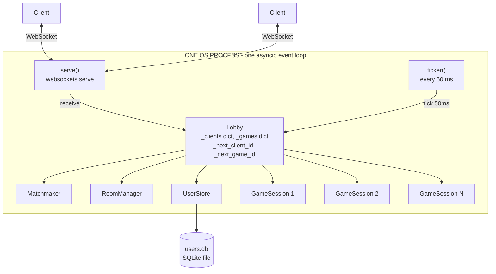
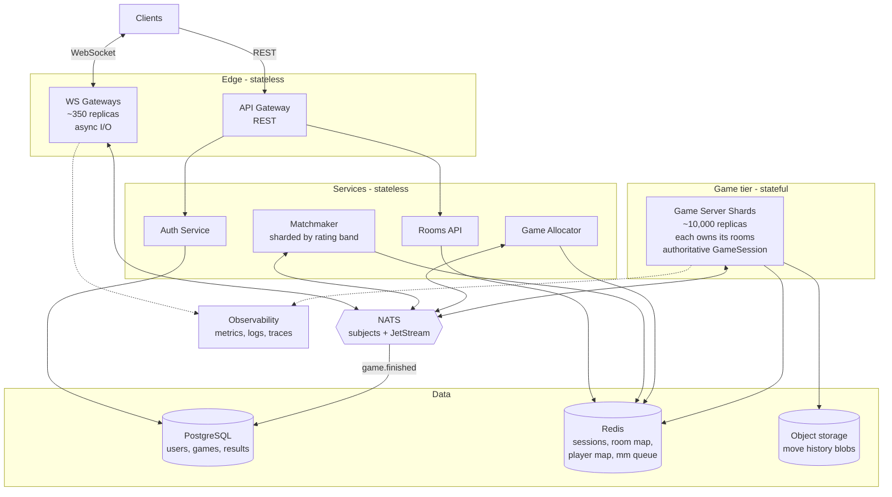
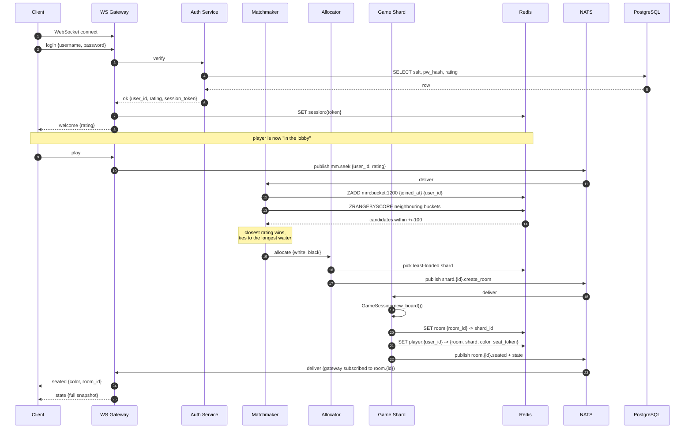
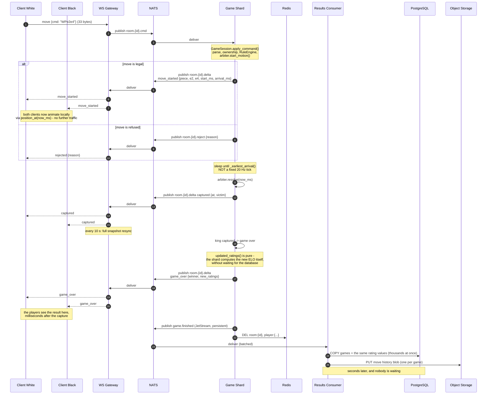
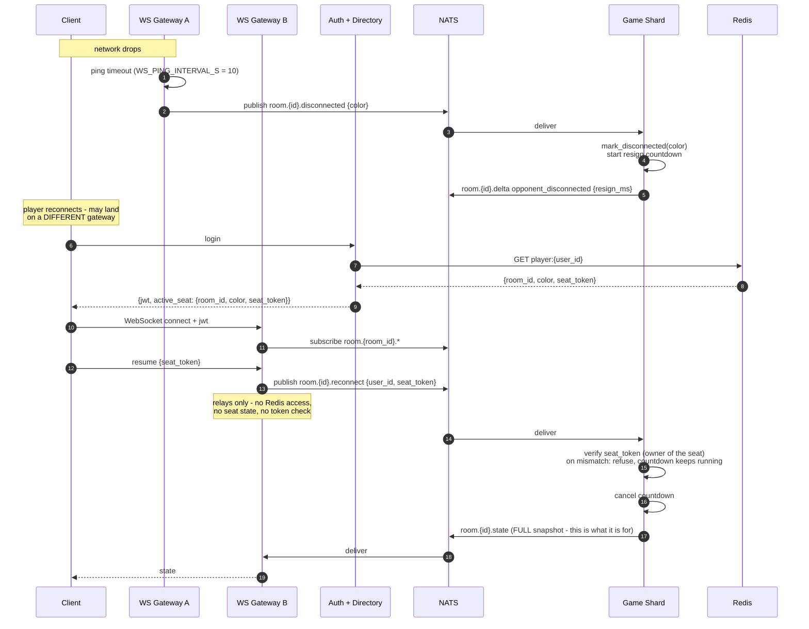
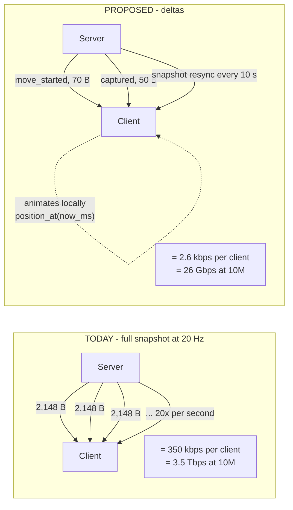
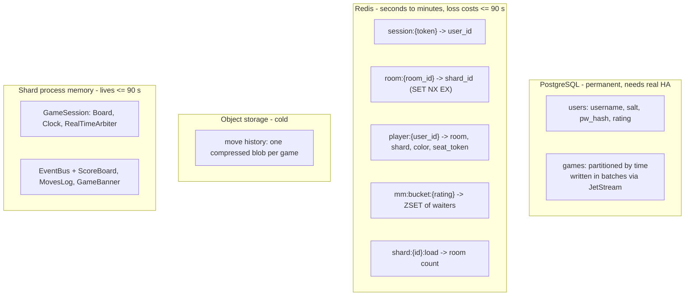

# Server Design — Scaling Kung Fu Chess

**Project:** Kung Fu Chess
**Author:** efratkamatech
**Date:** 27 July 2026
**Hebrew version:** [`Server_Design.md`](Server_Design.md)
**Stage-by-stage plan:** [`Implementation_Plan.md`](Implementation_Plan.md)

This document answers the four scaling questions set by the instructors, and describes
how **the server that already exists in this project** becomes a system that can serve
100 million registered users and 10 million concurrent players.

It is not a generic description of a diagram. Every number here was either **measured**
from the running code or **derived** from `config.py`, and every component in the target
architecture is mapped explicitly onto code that already exists and works.

---

## Table of contents

0. [The user, the budget, and the assumptions](#0-the-user-the-budget-and-the-assumptions)
1. [Where we are today](#1-where-we-are-today)
2. [The four answers](#2-the-four-answers)
   - [2.1 Which database for 100M users?](#21-which-database-for-100m-registered-users-is-sqlite-suitable)
   - [2.2 Is one server enough for 10M concurrent?](#22-is-one-server-enough-for-10m-concurrent-players)
   - [2.3 How much network traffic?](#23-a-move-every-two-seconds--how-much-traffic-is-that-a-lot-or-a-little)
   - [2.4 What a 30–90 second game implies](#24-games-last-3090-seconds--what-does-that-mean-for-the-containers)
3. [The proposed architecture](#3-the-proposed-architecture)
4. [How it actually works — detailed flows](#4-how-it-actually-works--detailed-flows)
5. [Where state lives](#5-where-state-lives)
6. [Failure model](#6-failure-model)
7. [Implementation stages](#7-implementation-stages)
8. [Verification](#8-verification)
9. [Decision summary](#9-decision-summary)

---

## 0. The user, the budget, and the assumptions

### Who this is for, and what she gets

> Someone with ten spare minutes who wants a game of chess **right now**, against a
> stranger of roughly her own strength, without waiting for anybody to think. She presses
> Play and is moving pieces within seconds; nobody's turn ever blocks hers.

Everything below is justified by that sentence, and it is what the cuts are made against.
The two halves of it pull in different directions and both are load-bearing: *within
seconds* is why matchmaking may not be fussy, and *nobody's turn blocks hers* is why the
server is authoritative and why a move has a latency budget rather than a best effort.

### The latency budget

"As fast as possible" is a missing number. The budget, set before the code and checked
against it afterwards:

| | Budget | Measured (S5) |
|---|---|---|
| A move is seen by the opponent, p99 | **≤ 100 ms** end to end | ~1 ms of it is the server |
| The server's own share of that | **≤ 10 ms** | **p99 ≤ 1 ms**, at every load tested |
| Getting into a game after pressing Play | ≤ 5 s | ~60 s under a 1,000-player rush — **missed**, see §2 |

The 100 ms is not a round number picked for looking tidy: below roughly that, a real-time
player attributes a delay to her own hand rather than to the game. Above it, she starts
aiming ahead of where the piece is.

**And it has to be symmetric, not merely small.** Two players are in the same game, so a
system that served one of them in 20 ms and the other in 120 ms would be *unfair* rather
than slow — one of them is simply playing an earlier version of the board. This is why a
room's traffic is one publish fanned out at the gateways rather than a message composed
per player: both players are served from the same message, so their delays differ only by
the last hop to each of them.

### Assumptions

Every one of these is a guess. They are on this table so a reader can argue with a line
instead of with the whole document — and so that when reality contradicts one, what has
to be revisited is written down rather than re-derived from memory.

| Assumption | Basis (why educated) | What breaks if wrong | How we would find out |
|---|---|---|---|
| A game lasts ~60 s | Midpoint of the stated 30–90 s | Game churn, and with it the "nothing is worth saving" failure model | Measure game duration — the shard already times every tick |
| A player moves every ~2 s | Given in the requirements | The whole traffic estimate in §2.3 | **Found out (S5):** measured at that rate, 470–490 B/s per player |
| "10M concurrent" means sockets held, not games in progress | Domain: players in the lobby, in the queue and watching all hold a socket | The gateway count (10M ÷ 30,000) is really a *socket* count; games are fewer | **Both are now published:** `kfc_connections` against `kfc_active_games` |
| One game costs ~50 µs a tick | Estimated from the engine's work per tick | Games per shard, and therefore the shard count | **Found out (S5): ~7 µs.** Seven times cheaper; the estimate was pessimistic |
| ~500 games fit on a shard | Arithmetic on the 50 µs above | The ~10,000-shard figure | **Found out (S5): ~30–40** — and not for CPU reasons. See §2 |
| Logging in is cheap enough to ignore | Never stated, which is the point — it was assumed by omission | Admission rate under a rush | **Found out (S5): 36.5 ms of PBKDF2 each, ~12/s per shard.** The costliest wrong assumption in this document — **fixed in S6**, which moved it to its own service |
| Two workloads on one thread degrade gracefully | Assumed by never asking | Whether a single-process deployment can be reasoned about at all | **Found out (S6): they oscillate.** Two identical runs admitted 410 and 998 players, the games moving in exact opposition |
| A player notices delay above ~100 ms | Typical for real-time browser games | If it is really 50 ms, a broker hop on the move path stops being affordable | Playtest, then read `kfc_move_handling_ms` |
| A full snapshot every 10 s is enough to repair drift | Chosen in S0; a client rebuilding from deltas can only drift so far | Bytes per player — the resync is the *larger* half of the bill | **Confirmed (S5):** raising the interval is the cheapest lever if traffic ever binds |
| Nothing in Redis is worth surviving a restart | Every key there has a TTL in minutes; accounts and ratings are in PostgreSQL | Redis would need persistence and HA, which is a different cost class | Restart Redis under load and see whether anything unrecoverable is lost |
| A shard crash costs ≤ 90 s of play and no rating | Games are short, and a result is written only on completion | Players would lose rating to an outage they did not cause | **Tested:** `test_a_game_lost_with_its_shard_changes_nobody_rating` |

Two of these were wrong, and the direction matters. The engine assumption was
**pessimistic** — being wrong there means headroom nobody counted on. The login
assumption was made by *not making it*, which is the failure mode this table exists to
prevent: it was never written down, so it was never checked, and it turned out to be the
number that binds.

---

## 1. Where we are today

> **This section describes the starting point** — the single-process server as it stood
> when this document was written, which is what the rest of the document reasons *from*.
> Stages S0–S5 have since been built and it no longer looks like this; §7 tracks what
> changed, and the current layout is at the end of this section.

The server in this project **works and is feature-complete**: six milestones shipped
(event bus, authoritative server + thin client, login, passwords + SQLite + ELO,
matchmaking + disconnect, rooms + spectators + logging), with ~470 tests, 100% coverage,
and green CI on Python 3.10 / 3.11 / 3.12.

`src/kfchess/server/` is eight modules, about 1,000 lines in total:

| Module | Responsibility |
|---|---|
| `game_server.py` | `serve()` — the only code that touches a real WebSocket (76 lines) |
| `lobby.py` | The synchronous hub: login, matchmaking, rooms, move routing, broadcast (359 lines) |
| `session.py` | `GameSession` — one authoritative game: engine + bus + observers |
| `matchmaker.py` | Waiting queue with a ±100 ELO window |
| `room_manager.py` | Maps a 4-character `room_id` to a `game_id` |
| `user_store.py` | Accounts and ratings in SQLite — PBKDF2, 100,000 iterations |
| `rating.py` | Pure ELO arithmetic, K=32 |
| `command_parser.py` | Parses `"WQe2e5"` into a `ParsedMove` |

### What today's architecture looks like



### What limits it

There are **two different limits**, and only one of them is the real problem.

**Limit A — performance.** Everything runs on one thread. `Lobby`, every `GameSession`,
`UserStore` — none of them are guarded by locks, because none of them need to be. This
is a speed ceiling, and speed ceilings are easy to raise.

**Limit B — the state lives in process memory.** This is the real problem:

```python
self._clients: dict[int, _Client] = {}
self._games:   dict[int, _LiveGame] = {}
```

These dicts live in this process's memory. A second process, on a second machine, gets
**its own memory** — it cannot see them.

So running a second copy of the server does not give us more capacity; it gives us two
disconnected worlds. A player on container A can never be matched with, join a room of,
or even see a player on container B.

> **The limit is not that the server is slow. The limit is that state lives in the
> process's RAM, so the second copy does not know the first one exists.**

This was a deliberate, documented decision — `docs/architecture.md` says
*"Single server process, in-memory state (v1)"* and leaves `multi-process scaling` under
"Open (decide later)". **This document closes that item.**

### Concrete pressure points

| # | Pressure point | File |
|---|---|---|
| 1 | One `Lobby`, one `ticker()` — no horizontal story at all | `game_server.py` |
| 2 | `_members(game_id)` scans **every** client, twice per game per tick | `lobby.py:334` |
| 3 | `_next_client_id` / `_next_game_id` — process-local counters, meaningless across nodes | `lobby.py:83` |
| 4 | `_reconnect_seat(username)` scans **every** game on every login | `lobby.py:173` |
| 5 | Full snapshot at 20 Hz per client, rebuilt each broadcast, no delta and no cache | `lobby.py:338` |
| 6 | `tick` uses a nominal `dt_ms` of 50, not elapsed time — simulation drifts under load | `lobby.py:296` |
| 7 | One `sqlite3.Connection`, `check_same_thread=True`, one file | `user_store.py` |
| 8 | Rooms and the matchmaking queue are in-memory dicts — a restart drops every live game | `lobby.py`, `room_manager.py` |
| 9 | No per-game isolation — one slow `resolve()` blocks the loop for every game | `lobby.py:303` |

### And what it looks like now (after S0–S5)

Kept here so that a reader comparing this document against the repository is not misled:
three of the modules named above **no longer exist**, and the test count is 810 rather
than ~470.

| Then | Now | What happened |
|---|---|---|
| `game_server.py` | `gateway/app.py` + `server/shard.py` | S2 split the sockets off the games |
| `matchmaker.py` | `services/matchmaker.py` | S3 moved the queue where every shard can see it |
| `room_manager.py` | `services/rooms.py` | S3 made a room id unique across shards, not just one |
| — | `services/{store,directory,allocator,shared}.py` | S3–S4: the shared state, and who runs what |
| — | `server/solo.py` | The same gateway, shard and lobby in one process, with no infrastructure |
| — | `obs/` | S5: the numbers this document was sized on, measured |

Of the nine pressure points above, **1–5 and 8 are addressed**; 6 was fixed in S0
(elapsed time, not a nominal 50 ms); 7 became PostgreSQL in S1. **9 is the one that
remains**, and S5 measured what it costs: see §2.

---

## 2. The four answers

### 2.1 Which database for 100M registered users? Is SQLite suitable?

**No — but not for the reason that comes to mind first.**

#### Size is not the problem

The current schema is one table:

```sql
CREATE TABLE users (
    username TEXT PRIMARY KEY,
    salt     BLOB,      -- 16 bytes
    pw_hash  BLOB,      -- 32 bytes
    rating   INTEGER    --  4 bytes
)
```

```
row ≈ 100 bytes
100,000,000 rows × 100 bytes  =  10 GB
with an index on username     ≈  15–20 GB
```

**20 GB is nothing.** A laptop SSD holds it. SQLite itself holds it — its theoretical
limit is 281 TB.

> Size is not the reason. 100 million users is 10 GB, and SQLite handles that fine.
> It fails for a completely different reason.

#### What actually breaks SQLite

The distinction everything rests on: **SQLite is an embedded library, not a service.**

- **SQLite** — `import sqlite3` starts no new program. Your Python process opens a file
  and reads and writes bytes in it itself. **Your process *is* the database engine.**
  The "database" is a file.
- **PostgreSQL** — a separate program, listening on port 5432. Your process sends it
  messages over the network. Many processes, on many machines, all talk to the same one.

Once you see that distinction, "can 10,000 containers share this?" answers itself. There
is nobody to talk to. There is no address.

Three reasons, in order of severity:

1. **No network protocol.** A container in Frankfurt cannot "open a file" that sits in
   Virginia. And over a shared filesystem it is worse than useless: SQLite coordinates
   concurrent access with OS **file locks** (POSIX advisory locks), which are a feature
   of the *local* kernel. Over NFS those implementations are partial and buggy — SQLite's
   own documentation warns against it. The failure mode is not "slow", it is **two writes
   clobber each other and the file is corrupted**. Silent data loss.
2. **One writer at a time.** SQLite locks the whole database for a write — not the row,
   not the table. Even in WAL mode, writes queue behind one another. Against ~83,000
   game results per second (see 2.4) this does not begin to work.
3. **No replication, no failover, no roles.** The disk dies and all 100 million accounts
   are gone.

#### The decision: PostgreSQL, with `UserStore` unchanged

The public interface stays **word for word**:

```python
register_or_login(username, password) -> Optional[int]
get_rating(username) -> int
set_rating(username, rating) -> None
record_win(winner, loser) -> None
```

Only the backend changes. This matters because **~470 tests and the 100% coverage gate
depend on SQLite with `":memory:"`**. Changing the interface would break the entire test
suite and the CI gate.

So SQLite stays — as the backend for local development and tests. Postgres goes to
production. This is exactly the dependency-injection principle `docs/architecture.md`
demands from day one, finally paying off.

| | SQLite (today) | PostgreSQL (proposed) |
|---|---|---|
| Model | library inside the process | service with a network protocol |
| Concurrent writers | 1 | many (MVCC) |
| Replication | ❌ | primary + read replicas |
| Sharding | ❌ | partition by `hash(user_id)` |
| Connection pooling | n/a | PgBouncer |
| Used for | tests, dev, VPL | production |

#### The real pressure is results, not users

The `users` table is **static** — a person registers once in their life. 100 million rows
that barely move; a single Postgres node chews through that.

The real pressure is **results**:

```
10,000,000 players ÷ 2  =  5,000,000 active games
average game = 60 seconds

games finishing per second = 5,000,000 ÷ 60 ≈ 83,000
```

This is **Little's Law**: `L = λ × W`, so `λ = L / W`. The number of items in a system
equals arrival rate times residence time.

And if we stored move history too:

```
60 s game, each player moves every 2 s
= 0.5 moves/s × 2 players × 60 s = 60 moves per game

83,000 games/s × 60 moves = 5,000,000 rows per second
```

**Five million rows per second.** No Postgres in the world swallows that. Not ten of them.

Three consequent decisions:

- **Results are written asynchronously.** The shard does not wait for the DB. It
  publishes `game.finished` to NATS and moves on; a dedicated consumer batches thousands
  of results into one `COPY`. **The write leaves the hot path** — a player does not wait
  on a disk to learn she won.
- **The `games` table is partitioned by time** (day or hour), so pruning old data is
  `DROP PARTITION` (instant) rather than `DELETE` over billions of rows (hours, plus
  locks).
- **Move history never enters Postgres.** One compressed blob per game in object storage
  (S3 and compatibles), keyed by `game_id`. Sixty rows become one object. `MovesLog` in
  `observers.py` already produces exactly that list, so the conversion is one line.

**Redis** completes the picture for temporary data that must never touch Postgres:
sessions, `room_id → shard_id`, `player → room`, and the matchmaking queue.

**The rule: anything worth more than 90 seconds goes to Postgres. Everything else goes
to Redis.**

---

### 2.2 Is one server enough for 10M concurrent players?

**No, and by four orders of magnitude.**

#### How many containers

```
10,000,000 players ÷ 2  =  5,000,000 active games

Per shard:
  500 games × 20 ticks/s      = 10,000 resolve() calls per second
  10,000 × ~50 µs each        = 0.5 CPU-seconds per second
                              = 50% of one core
  (the other half goes to JSON encoding and I/O)
```

| Component | Calculation | Result |
|---|---|---|
| Game Server Shards | 5M ÷ 500 | **~10,000** |
| WS Gateways | 10M ÷ 30,000 connections | **~350** |
| Matchmaker / Rooms / Allocator | stateless, by load | tens |

**These are estimates, and this document says so explicitly.** That is not a weakness —
it is the correct posture. What matters in the *design* is not the exact number, but that
**no component is bound to a single process**: to add capacity you add another replica.

#### What S5 measured, and where the estimates were wrong

Run with `tools/loadbot.py` against `server_main.py --solo` — **one process holding the
gateway, the shard and every socket, with the load generator on the same laptop**. That
caveat carries all the weight below: it is the least favourable arrangement this code has,
and the split deployment was not measured because Docker was not running on the machine.

| Assumption | Estimated | Measured | Verdict |
|---|---|---|---|
| One game, one tick | ~50 µs | **~7 µs** (p99 ≤ 50 µs) | **7× better than assumed** |
| Server's share of a move | — | **p99 ≤ 1 ms**, at every size tested | not the constraint |
| Bytes per connection | ~325 B/s | **470–490 B/s** | optimistic by ~45% |
| Games before p99 > 100 ms | ~500 | **~30–40** | **far worse — and not for the reason the estimate was about** |
| Logins admitted per second | never considered | **~12/s** | **was the real limit; Auth is its own service now** |
| Matches per second | "the hot path" | ~8/s, never visible | **refuted** |

**The engine was never the problem.** Every server-side number stayed flat as load grew:
seven microseconds a tick at 25 games and at 353, one millisecond to handle a move
throughout. The capacity calculation above — half a core for five hundred games — is
*generous* by the measurement; at 7 µs it would be a fifteenth of a core.

**What actually degrades is the loop.** The tick rate fell from 17.6 Hz at 25 games to
9.8 Hz at 100, against a 20 Hz ceiling, and end-to-end latency followed it. Cutting the
move rate to a third changed nothing, so it is not move throughput: it is that one
asyncio loop is running the games, fanning every broadcast out to every socket, and doing
both between the arrival of a move and anybody hearing about it. In the split deployment
those are two processes on two cores and the shard writes to no sockets at all — which is
the measurement still owed.

**And the finding nobody was looking for: the password hash is the admission gate.** One
`register_or_login` costs **36.5 ms of pure CPU** (PBKDF2, 100,000 rounds — chosen
deliberately in M4, and correctly). It runs on the thread that runs the games. Of 1,000
connections opened at once, **706 were seated within 60 seconds**; the rest were still
queued behind other people's hashes. That is ~12 logins a second per shard, and it is not
a number that improves by adding games or removing them.

The design already had the answer: §3 puts **Auth in its own stateless service**,
precisely so that the expensive, embarrassingly parallel part of logging in can be scaled
by replica count without touching the shards.

#### It has now moved — and what that is worth, measured and unmeasured

**Measured, and this is the change itself:** handling a `Login` on the shard's own thread
went from **35.0 ms to 9 µs** — it publishes the password and returns. The hashing still
costs what it always did; it simply no longer happens where the games are.

| | Before | After |
|---|---|---|
| The shard's thread, per login | 35.0 ms | **0.009 ms** |
| Where the 36.5 ms happens | on the games' thread | on an Auth replica that owns no games |
| Admissions per second | ~12, per shard, unimprovable | ~27 per Auth replica, and you can start more |

**Unmeasured, and it must be said as plainly as the rest:** the end-to-end gain belongs to
the split deployment, and the split deployment still cannot be run on this machine. What
*was* run — a thousand connections against `--solo`, where Auth shares the one thread —
cannot show it, and did not. It showed something else worth recording instead.

Two identical 60-second runs came out at **410 and 998 players seated**, with the games
moving in exact opposition: the run that admitted 410 ticked 88,000 times and averaged
91 ms a move; the run that admitted 998 ticked 13,000 times and averaged 614 ms. One
thread, two workloads, and the split between them decided by scheduling rather than by
anything anybody chose.

That is not a result about Auth. It is an argument for the whole shape of this design:
**work that competes for one thread does not degrade, it oscillates**, and which half
suffers is not a property you can reason about from the code. Putting the two on separate
processes is what makes either of them predictable.

**Why multiple regions?** 10 million players "from all over the world" cannot sit on one
continent anyway. `MS_PER_CELL = 1000` — a piece crosses a square in one second. A 300 ms
cross-ocean round trip is **a third of a piece's travel time**. The game stops being a
real-time game.

#### How do we know which player is on which server?

Today, `lobby.py:173`:

```python
def _reconnect_seat(self, username):
    for game_id, game in self._games.items():     # every game
        ...
```

A linear scan over every game, on every login. With 5 million games this is impossible —
and worse, one shard only sees *its own* games, so it would never find a player seated
elsewhere.

**Redis becomes the phone book:**

```
player:{user_id}  →  { room_id, shard_id, color, seat_token }   (short TTL)
room:{room_id}    →  { shard_id, phase, created_ms }
```

Lookup goes from O(all games) to **O(1)**.

**Bonus:** this also closes a real security gap. Reconnect is currently identified by
**username alone**, with no token — anyone who knows your name can take your seat. The
`seat_token` fixes that.

#### How does "everyone can play with everyone"?

This is the subtlest point in the section.

**The natural mistake:** *"I have 10,000 shards, each running games — so let each shard
match its own players."*

That breaks the requirement. Matching inside a shard produces **10,000 disconnected
pools**. A player in pool 3 can *never* meet a player in pool 7. That directly
contradicts what was asked: *"everyone can play with everyone."*

**The fix: a Matchmaker that is global per region**, over one logical queue in Redis
sorted sets, bucketed by rating:

```
mm:bucket:1200  →  ZSET { user_id: joined_at_ms }
mm:bucket:1250  →  ZSET { user_id: joined_at_ms }
```

A Redis sorted set keeps members ordered by a score. Here the score is **join time**, so
the longest waiter is always first.

Your existing rules survive intact:

| Rule in `matchmaker.py` | In Redis |
|---|---|
| `MATCH_ELO_RANGE = 100` window | scan the player's bucket plus its neighbours |
| Closest rating wins | unchanged |
| Ties go to the longest waiter | **free** — it is the ZSET ordering |

The buckets do not change the rules; they **shrink the search space** from 10 million to
a few thousand. The linear scan becomes a `ZRANGEBYSCORE`.

**And the Matchmaker itself shards naturally:** two players 500 rating points apart never
need to meet, so one instance can own 1000–1200 and another 1200–1400, and **they never
have to talk to each other**. The partition is already inside the problem.

#### How does anyone join any room?

`room_id → shard_id` in Redis, and then the Gateway subscribes to the NATS subject
`room.{room_id}.state`.

**The Gateway does not need to know which shard runs the room at all.** NATS routes it.
That is also what lets a spectator join any room: she just subscribes. Nobody has to
physically route her to a specific server, and there is no limit on the number of
listeners.

#### Stateless versus stateful

| Kind | Components | Property |
|---|---|---|
| **Stateless** | API Gateway, WS Gateway, Auth, Rooms API, Matchmaker, Allocator | any instance serves any request; scale = add replicas |
| **Stateful** | Game Server Shards | each shard is the **exclusive owner** of its rooms |
| **Backing** | PostgreSQL, Redis, NATS | managed services |

The single-writer principle — one shard, and only that shard, touches a given game — is
exactly what `docs/architecture.md` called the **Session Actor**:

> *"One command queue/task per game — single-writer into GameEngine/RealTimeArbiter"*

**That layer was never built** — `Lobby` calls sessions directly. In the new architecture
it is finally built, and it is precisely what makes a shard safe to replicate.

---

### 2.3 A move every two seconds — how much traffic? Is that a lot or a little?

This is the section that produced the most surprising finding in the document.

#### First: these numbers were measured

I ran a real `GameSession` from the opening board and encoded the messages through
**exactly the code the server runs**:

```python
from kfchess.shared.tokens import load_board_csv
from kfchess.server.session import GameSession
from kfchess.shared.protocol import State, Move, encode
from kfchess.config import BOARD_CSV
from kfchess.model.color import Color

s = GameSession(load_board_csv(BOARD_CSV))
s.set_name(Color.WHITE, "efrat"); s.set_rating(Color.WHITE, 1200)
s.set_name(Color.BLACK, "noa");   s.set_rating(Color.BLACK, 1213)
s.assign_color(); s.assign_color()

print(len(encode(State(s.snapshot()))))   # 2148
print(len(encode(Move("WPe2e4"))))        # 33
```

| Message | **Measured** size |
|---|---|
| `State(snapshot)` — full opening board, two players connected | **2,148 bytes** |
| `State` after one move (first log line) | 2,160 bytes |
| `Move("WPe2e4")` | **33 bytes** |

#### Inbound traffic — tiny

```
  33 bytes   the JSON itself
+  6 bytes   masked WebSocket frame
+ 40 bytes   TCP/IP headers
─────────────
≈ 80 bytes per move

10,000,000 players × 0.5 moves/s × 80 bytes = 400 MB/s = 3.2 Gbps
```

**3.2 Gbps is a little.** A single datacenter link is 100 Gbps — so every player move on
Earth fits in a third of one modern NIC.

#### Outbound traffic — this is where it breaks

Today, `lobby.py:338`:

```python
def _broadcast_state(self, game_id):
    text = encode(State(self._games[game_id].session.snapshot()))   # 2,148 bytes
    for client in self._members(game_id):
        client.send(text)
```

called from `tick`, with `SERVER_TICK_MS = 50` — **twenty times per second**:

```
2,148 bytes × 20/s           = ~43 KB/s   ≈ 350 kbps per client
350 kbps × 10,000,000        = ~3.5 Tbps
```

**3.5 terabits per second** — the scale of a large content delivery network, for a board
game whose entire activity is one piece moving every two seconds. **A thousand times the
inbound traffic that causes it.**

#### Why the asymmetry exists — the insight

The server sends **the whole world, on a fixed clock, regardless of whether anything
changed**.

Think of it in terms of *information*. How much **new** information exists per second for
one player?

```
one opponent move every 2 seconds  =  ~16 bytes/s of new information
what we actually send              =  43,000 bytes/s
                                      ────────────────
                                      a factor of ~2,700
```

*"But the piece really is moving!"* — true, and that is the subtle part:

> **State that changes is not necessarily new information.**

A piece travelling from e2 to e4 does change position every frame. But once we have
announced *"this piece left e2 at t=1000 and arrives at e4 at t=3000"*, **everything else
is deterministic**. It is a pure function — and it already exists in the code, as
`Motion.position_at(now_ms)`.

The client can simply **compute** it. There is no reason to broadcast the result 20 times
a second.

#### The fix: send changes, not pictures

The client **already knows** `MS_PER_CELL = 1000` and `COOLDOWN_MS = 1000` from
`config.py`. Give it `(piece, from, to, start_ms)` and it draws the whole motion itself.

New delta messages in `shared/protocol.py`:

| Message | When | Size |
|---|---|---|
| `move_started` | a move began | ~70 B |
| `captured` | a capture | ~50 B |
| `blocked` | a piece was blocked | ~45 B |
| `cooldown_done` | cooldown elapsed | ~35 B |
| `game_over` | game ended | ~40 B |
| `state` (existing) | reconnect and resync every 10 s | 2,148 B |

```
~1 event/s × ~110 bytes                 =  110 B/s
snapshot resync every 10 s: 2,148 ÷ 10  =  215 B/s
                                    ─────────────────
                             total ≈ 325 B/s ≈ 2.6 kbps

2.6 kbps × 10,000,000 = ~26 Gbps
```

| | Today | Proposed | Improvement |
|---|---|---|---|
| Per client | ~350 kbps | ~2.6 kbps | **×135** |
| 10M clients | ~3.5 Tbps | **~26 Gbps** | **×135** |
| Per gateway (of ~350) | — | ~75 Mbps | entirely reasonable |

Note that after the fix, the **resync** (215 B/s) is larger than the events themselves
(110 B/s). Pushing resync to 30 seconds gives ~1.5 kbps and ~15 Gbps — there is more
headroom if we need it.

**Measured, after S0** (a 30-second game through the real `Lobby`, both sides moving
every two seconds — so twice the event rate assumed above):

| | Estimated | Measured |
|---|---|---|
| Full snapshot | 2,148 B | **2,650 B** (`piece_id` now rides each cell) |
| Per client | ~325 B/s | **537 B/s** (4.3 kbps) |
| Improvement over 20 Hz snapshots | ×135 | **×98.8** |

The gap is the event rate, not the protocol: at the design's one-move-per-two-seconds
this lands within a few percent of the estimate. The shape of the result holds — the
resync is still the larger half of the bill (265 B/s of the 537).

**Measured again in S5**, this time over real WebSockets with the load bot rather than
through the `Lobby` directly: **470–490 B/s per connection** across 25–50 concurrent
games. The S0 bench figure holds under load; the original 325 B/s estimate is optimistic
by about half, and the resync remains the larger half of the bill.

#### Bonus: the same idea cuts CPU

`Lobby.tick()` runs 20 ticks per second per game **even when nothing is happening**. But
`RealTimeArbiter` **already has** `_earliest_arrival()` — it already knows when the next
event is.

Instead of a fixed clock, **sleep until the next event**:

```
1 move-start/s + 1 arrival/s + 1 cooldown-end/s ≈ 3 events
versus 20 ticks                                  → ~7× saving
```

This fits naturally with the single-time-window model already in `arbiter.resolve(now_ms)`,
which is built to accept an arbitrary "now" and process everything up to it.

#### Does this break the authoritative server?

The instructions say explicitly:

> *"The client does not decide game rules... the GameEngine remains the single source of
> truth."*

So: **if the client computes positions itself, is that violated?**

**No, and the distinction is sharp:**

| The client **does** | The client **does not** |
|---|---|
| Compute where to draw a piece between two announced points | Decide whether a capture happened |
| Show a cooldown gauge draining | Decide whether a move is legal |
| Interpolation — **arithmetic** | Adjudication — **judgement** |

The server announced *"this piece left e2 at t=1000 and arrives at e4 at t=3000."* A
client drawing it halfway at t=2000 is doing **arithmetic, not judgement**. If a
collision occurs mid-path, **the server announces** `captured` and the client obeys
immediately. Authority has not moved an inch.

#### The conclusion that reorders everything

> **Moves = a little (3.2 Gbps). Full snapshots = far too much (3.5 Tbps).**
>
> **The bottleneck is the protocol, not the infrastructure.**

You could stand up all the Kubernetes in the world and still need 3.5 Tbps. That is why
**S0 in the implementation plan is the protocol change** — before Docker, before
Kubernetes, before anything. It needs no new infrastructure, it is covered by the
existing 470 tests, and it is worth a factor of 135.

---

### 2.4 Games last 30–90 seconds — what does that mean for the containers?

This sounds like a minor detail. It is not — **it sets the complexity level of the entire
system**, and in our favour.

> A 60-second game is a design gift. It deletes the most expensive part of any
> distributed system.

#### Five things it makes easy

**1. There is no long-lived state worth moving.**

In any distributed system the most expensive part is: what happens to state when a
machine dies or must be taken down? The usual answers:

- **Live migration** — move a running game from one shard to another mid-flight. Freeze,
  serialise all state, ship, restore, re-route every client. A nightmare.
- **Replication** — every shard keeps a live copy on another shard. Doubles CPU and adds
  synchronisation latency **inside the hot loop**.

**We need neither.** A shard dying costs at most 90 seconds of games. **The damage is
bounded by definition.** Building a mechanism to protect data worth ninety seconds costs
more than it saves.

**2. Draining before a deploy is cheap.**

*Draining* means: stop sending an instance new work and wait for its current work to
finish, so it can be killed without hurting anyone.

| | KFC | An MMO with 2-hour sessions |
|---|---|---|
| Drain | "stop accepting rooms, wait 90 s" | wait two hours, or kick players |
| Rolling deploy of 10,000 containers | routine | a planned event |

**3. Autoscaling reacts almost immediately.**

The fleet turns over completely every ~60 seconds. Demand spikes and new containers fill
within a minute; demand drops and containers empty **by themselves** within a minute.

A system with long sessions has a *tail*: demand fell, but half-empty machines stay alive
for hours because a few old sessions still run on them. **We have no tail.** That matters
particularly for 10M players "from all over the world", where demand follows the sun.

**4. Dumb allocation suffices.**

The Allocator can simply pick the least-loaded shard. Normally you would need something
like *consistent hashing* — an algorithm that maps keys to servers so that adding a
server moves only a small fraction of keys, existing to avoid expensive rebalancing.

**We have nothing to rebalance.** Any imbalance disappears on its own within 90 seconds
as games end. **The problem fixes itself faster than a clever algorithm would fix it.**

**5. Agones is not necessary at first — and here I deviate from the diagram.**

**What is Agones?** A Kubernetes extension built for game servers, giving two things:
(a) explicit *allocation* — marking a server as "in use by this match" so Kubernetes will
not kill it; and (b) long *graceful shutdown* — waiting for a match to finish.

Both are critical when a match lasts an hour. With a 60-second game, a plain `Deployment`
with an HPA gives nearly the same value at a fraction of the complexity.

**Decision: deferred to S6+, and only if load testing shows it is needed.**

#### Three things it makes hard

**6. The churn is enormous.** ~83,000 room creations and destructions **per second**.

- **Room creation must be Redis-only** — no synchronous Postgres write.
- **And here is a real bug in the existing code.** The id is 4 uppercase hex characters
  (`secrets.token_hex(2).upper()`) = **65,536 possibilities**, against **~5,000,000
  rooms live at once**. The space is 76× too small.

  But the severity is not collisions — it is `RoomManager.create`:

  ```python
  room_id = self._generate_id()
  while room_id in self._game_by_room:   # unbounded loop
      room_id = self._generate_id()
  ```

  Once the id space fills, `_generate_id()` always returns a taken value and **the loop
  never terminates**. This happens inside `_on_create_room`, on the single event loop —
  so **the entire server freezes**, every game and every client on it. Not "collisions
  are occasionally possible" but a deterministic hang.

  The fix, scheduled for S0, has three parts:
  1. **A wider alphabet rather than a longer id** — Crockford base32
     (`0123456789ABCDEFGHJKMNPQRSTVWXYZ`, dropping the confusable `O`/`0` and `I`/`1`/`L`),
     6 characters = 1.07 billion ids at a 0.47% load factor. Shorter than 8 hex characters
     **and** easier to read aloud — and a room id exists to be shared.
  2. **Bound the loop** — a fixed number of attempts, then raise. Better to fail loudly on
     one request than to hang silently on all of them.
  3. **`remove_game` is a linear scan** over every room to find one — the same weakness as
     `Lobby._members`, at 83,000 endings per second. A reverse map `game_id → room_id`
     makes it O(1).

  In the distributed world (S3) the check must move to Redis anyway, since an in-memory
  dict cannot stop two shards handing out the same id. There it is one atomic operation,
  `SET room:{id} {shard} NX EX {ttl}`, and the TTL also frees ids stranded by a shard
  crash.

**7. The Matchmaker is the real hot path — not the game.** 83,000 matches per second.
Intuition says the game is the heavy part, but a game runs quietly in the background for
60 seconds while the Matchmaker never stops. **This, not the engine, is what load testing
should measure first.**

**8. The reconnect window is too long.** `RESIGN_COUNTDOWN_MS = 20_000` is **a third of an
average game**. A player disconnected for 20 seconds has effectively already lost — her
opponent played a third of the game alone. Worth shortening to 8–10 seconds.

---

## 3. The proposed architecture



### The mapping from existing code — the core of this design

The diagram is not the achievement; every team was given the same nine boxes. What makes
this **my** design is where each module I already wrote ends up:

| Today | Becomes | Note |
|---|---|---|
| `game_server.serve()` | **WS Gateway** | keeps only sockets + token check |
| `Lobby._on_login` + `UserStore` | **Auth Service** + PostgreSQL | same public interface, different backend |
| `Lobby._on_play` + `Matchmaker` | **Matchmaker service** + Redis | one logical queue, rating buckets |
| `_on_create_room` / `_on_join_room` + `RoomManager` | **Rooms API** + Redis | id widens, mapping goes global |
| `Lobby._games` + `tick` + `_broadcast_*` | **Game Server Shard** | the god-object splits |
| `GameSession` | **unchanged** | finally the Session Actor from `architecture.md` |
| `EventBus` (per game) | **stays in-process** | see below |
| `rating.py`, `command_parser.py` | **unchanged** | pure functions — they travel anywhere |
| `shared/protocol.py` | kept + delta messages | JSON stays; binary only if load tests demand |
| `shared/snapshot.py` | kept, narrower role | resync and reconnect only, not the steady stream |

### The pattern is not an accident

```
Lobby  ─┬─→  WS Gateway      (connect / disconnect / receive)
        ├─→  Auth Service    (_on_login)
        ├─→  Matchmaker      (_on_play)
        ├─→  Rooms API       (_on_create_room / _on_join_room)
        └─→  Game Shard      (_games / tick / _broadcast_*)
```

**Only `Lobby` splits.** It is the god-object — 359 lines doing five jobs — but it is
already *organised* by those jobs, each in its own method. **The service boundaries run
along seams that already exist in the code.** This is not a rewrite; it is a cut.

Everything else stays because it is already single-responsibility and knows nothing about
the network.

### Three decisions that need explaining

**1. The in-process `EventBus` does not become NATS.**

The tempting suggestion: *"you already have an event bus — why not just wire it to NATS?"*
Because they solve different problems.

| | Your `EventBus` | NATS |
|---|---|---|
| Scope | **inside one game** | **between services** |
| Subscribers | `ScoreBoard`, `MovesLog`, `GameBanner` | Gateways, consumers, other systems |
| Synchronous? | yes — same stack frame | no — crosses the network |
| Latency | zero | milliseconds |

Making the `EventBus` networked would add latency and uncertainty **in the hot loop** for
no benefit — its subscribers live in the same process anyway. **NATS is the bus *between*
services; the `EventBus` is the bus *inside* a game. Both stay.**

**2. Identifiers must become global.** `_next_client_id` and `_next_game_id` are
process-local counters; two shards would both mint `game_id = 0`.

| Today | Becomes |
|---|---|
| `game_id: int` (counter) | UUID, or `{shard_id}:{seq}` to keep logs readable |
| `client_id: int` (counter) | `user_id` from Postgres + a gateway-local `connection_id` |

**3. Protocol before infrastructure.** All the Kubernetes in the world still needs
3.5 Tbps without the protocol change.

### Where I deviate from the instructors' diagram

The instructions said: *"you may implement however you like, but it is important to
understand the division of responsibility and to stand behind your decisions."* This
table is the direct answer to that.

| In the diagram | My decision | Reasoning |
|---|---|---|
| Agones (optional) | **deferred to S6+** | 60-second games need no explicit allocation; `Deployment` + HPA suffice |
| NATS as the bus | **adopted** | subject-based routing is exactly right for `room.{id}` |
| Redis PubSub as an alternative | **rejected** | fire-and-forget with no persistence; `game.finished` needs JetStream |
| Observability last | **moved earlier, to S5** | without measurement every number in 2.2 is a guess |
| — | **added: protocol change as stage 0** | ×135, zero infrastructure |

On the Redis PubSub row: Redis PubSub is fire-and-forget — if nobody is listening at the
moment a message is sent, **it is gone**. That is fine for `room.{id}.state` (a missed
snapshot arrives again in 10 seconds). It is **not** fine for `game.finished`: if that
message vanishes, the result is never written and ratings never update. That needs
persistence, which is what NATS JetStream provides.

---

## 4. How it actually works — detailed flows

### 4.1 Login, matchmaking, and game start



**Key points to notice:**

- The Gateway never learns *which* shard runs the room. It subscribes to
  `room.{room_id}.*` and NATS does the routing.
- The Allocator picks a shard **after** the match is made, never before — because the
  unit of state is **the room, not the player**. Both players must land on the same shard.
- The full snapshot is sent exactly once here, at seating. After this, only deltas.

### 4.2 A move, and the end of the game



**Key points to notice:**

- A single 33-byte move produces one ~70-byte delta, not 20 full snapshots per second.
- Between `move_started` and `captured` the server sends **nothing**. Both clients
  animate from the same deterministic function.
- **Who tells the client it won?** The shard, and nobody else — it owns the arbiter that
  detected the king capture. It publishes **two separate messages on two subjects with
  two different guarantees**: `game_over` on `room.{id}.delta` reaches the players in
  milliseconds over ordinary pub/sub, while `game.finished` goes to the database over
  JetStream, batched, seconds later. **The player never waits for the database.** At
  83,000 games ending per second, a shard that blocked on a disk write would be blocked
  83,000 times a second.
- **The new rating travels with `game_over`.** `updated_ratings()` in `server/rating.py`
  is a pure function and the shard already holds both players' ratings from seating, so
  it computes the result locally and sends it immediately; the consumer later persists
  exactly the same numbers. This only works because ELO arithmetic lives outside
  `UserStore` — had it been a database method, the shard could not have done this.
- `game.finished` goes over **JetStream** (persistent), not plain pub/sub — losing it
  would mean losing a rating update.
- **One thing to change in the existing code:** `BusPublisher.on_game_over()` today
  publishes `GameOver()` with `winner=None`, because the winner is read off the snapshot
  instead. Once there is no snapshot every tick, the delta must carry the winner itself.

### 4.3 Disconnect and reconnect



**Key point:** the returning player may land on a completely different gateway, and
nothing breaks — because gateways are stateless and Redis holds the seat. This is
impossible in today's design, where the seat lives in one process's `_clients` dict.

**Why the gateway does not read Redis itself.** A WS Gateway is a pipe: terminate the
socket, verify the JWT that every request carries anyway, relay bytes. Letting it do the
seat lookup would give every replica the Redis key schema and Redis credentials; letting
it compare the `seat_token` would make each replica a security decision point. Both
belong elsewhere — the lookup to the directory service that owns `player:{user_id}`
([§7](#7-implementation-stages), `services/directory.py`), and the token check to the
**shard**, which issued the token, owns the room as its single writer, and is running the
resign countdown the token is meant to cancel. The gateway is told which subject to
subscribe to; it never derives it.

This costs no extra round trip: login already goes to Auth, so the seat rides back on the
login response. And note the gateway never learns `shard_id` — it does not need to, per
[§2.2](#22-is-one-server-enough-for-10m-concurrent-players). NATS routes `room.{id}.*` to
whichever shard owns the room.

### 4.4 The protocol change, visually



---

## 5. Where state lives



**The rule: anything worth more than 90 seconds goes to Postgres. Everything else goes to
Redis or stays in memory.**

---

## 6. Failure model

| Container | Lifetime of its state | What happens when it dies |
|---|---|---|
| WS Gateway | one connection | clients reconnect to another gateway; **rooms continue** |
| Matchmaker | seconds (queue wait) | waiting players press Play again |
| Game Shard | **≤ 90 seconds** | up to ~500 games voided; **ELO is unaffected** |
| Auth / Rooms API | stateless | completely transparent |
| PostgreSQL | **permanent** | failover to a replica |

> **Only PostgreSQL truly requires high availability.** Everything else can fall over and
> come back, because the data it holds is worth less than 90 seconds.

**Why ELO is unaffected by a shard crash:** `_maybe_record_result` only applies a rating
change when a game *finishes*. A game that crashed was never recorded, so no rating moves.
Players lose a game, not points — and that is also the fair outcome. This falls out of the
existing design for free.

---

## 7. Implementation stages

Full detail, file by file, is in [`Implementation_Plan.md`](Implementation_Plan.md).

| Stage | Content | Why here |
|---|---|---|
| **S0** | Delta protocol + event-driven tick + the `RoomManager` hang fix. Still one process. | Biggest single win (×135), zero new infrastructure, covered by the existing 470 tests |
| **S1** | `Dockerfile` + `docker-compose.yml`; `UserStore` on PostgreSQL | "something small that works" |
| **S2** | Extract the WS Gateway from `Lobby`; NATS between them | the first real split |
| **S3** | Matchmaker and Rooms as separate services on Redis | `Lobby` finishes dissolving |
| **S4** | N shards + Game Allocator (two shards in compose) | proves room placement works |
| **S5** | Observability: `/healthz`, Prometheus metrics, JSON logs, a load-test bot | without it, section 2.2 cannot be validated |
| **S6** | K3s manifests | from compose to a real orchestrator |

**The ordering principle:** *"something small that works beats trying to build everything
and having nothing work."* **Every stage ends with a running system.** There is no stage
that leaves the middle broken and hopes it resolves at the end.

**A constraint that spans every stage:** the "thin async shell over a synchronous,
testable core" split must survive. The 100% coverage gate depends on the async layer
staying thin enough to mark `# pragma: no cover`, and on the core being tested with fake
`send` callbacks and an explicit `tick(dt_ms)` instead of real time. **Every new service
is built to the same pattern.**

---

## 8. Verification

**1. Two real clients on compose (end of S1).**

```bash
docker compose up
```

Then two `client_main.py` instances — a full game from login through the ELO update.

**2. A load-test bot (S5).** A headless client that opens N WebSocket connections, moves
every two seconds, and measures:

| Measurement | What it validates |
|---|---|
| End-to-end latency, p50/p95/p99 | that the system plays at all |
| Bytes per second per connection | **the 2.6 kbps claim in 2.3** |
| Games per shard before p99 exceeds 100 ms | **the estimate of 500** |

**3. Explicit honesty about what is not verified.**

| Measured ✅ | Derived from `config.py` ✅ | **Estimated** ⚠️ |
|---|---|---|
| 2,148 bytes | `SERVER_TICK_MS = 50` | 500 games per shard |
| 33 bytes | `MS_PER_CELL = 1000` | 30,000 connections per gateway |
| | `RESIGN_COUNTDOWN_MS = 20_000` | ~50 µs per `resolve()` |
| | `HUD_MOVES_VISIBLE = 12` | ~110 bytes per delta message |

The estimates are labelled as estimates throughout, and S5 exists precisely to replace
them with measurements.

---

## 9. Decision summary

| Question | Answer | Reason in one line |
|---|---|---|
| Database for 100M? | **PostgreSQL** | SQLite is a library, not a service — containers cannot share a file |
| Is SQLite suitable? | **No** (kept for tests) | one writer; no network; no replication |
| Move history? | **Object storage, not Postgres** | 5M rows/second does not fit a relational DB |
| Is one server enough? | **No** — ~10,000 shards + ~350 gateways | estimate, to be validated by load test |
| Where is each player? | **Redis**: `player → {room, shard}` | replaces a linear scan with O(1) |
| How does a message find its shard? | **The connection is claimed**, and the gateway is told | a queue group hands each new socket to exactly one shard; a seat moves the claim to whoever runs the game |
| Everyone plays everyone? | **Global Matchmaker**, not per-shard | otherwise 10,000 disconnected pools |
| Traffic from moves? | **3.2 Gbps — a little** | a third of one NIC |
| Traffic from broadcast? | **3.5 Tbps — far too much** | full snapshot at 20 Hz |
| The fix? | **Deltas** → 26 Gbps | ×135, with no new infrastructure |
| What did the maths send back to the code? | **A hang in `RoomManager.create`** | unbounded loop against a 65,536-id space |
| Implication of 30–90 s games? | **No state worth saving** | no migration, no replication, a 90-second drain |
| Agones? | **Deferred to S6+** | short games do not justify the complexity |
| What needs HA? | **Only PostgreSQL** | everything else holds data worth <90 seconds |
| Does the game still run on one machine? | **Yes — `--solo`, and it must** | the same code over an in-process bus and store; infrastructure is a deployment choice, never a condition for playing |
| Was the ~50 µs tick right? | **No — it is ~7 µs** | measured in S5; the engine has seven times the headroom the sizing assumed |
| What actually limits a shard? | **Logging in, then the event loop** | PBKDF2 costs 36.5 ms on the game thread; the engine never appears |
| Where does the password check belong? | **Its own stateless service** | 35 ms off the games' thread; admissions become a number you raise with replicas |

### The rule that came out of building it

Every piece of shared state is **injected**, and its default is an implementation inside
the process. Redis and NATS are what a *deployment* supplies, not what the game depends
on: `python server_main.py --solo` runs the same gateway, the same shard and the same
lobby, with a dictionary where Redis is and a function call where NATS is.

This is a design constraint, not a convenience. The moment there are two implementations
of anything — a "local mode" branch in the lobby, a second matchmaker for laptops — they
drift, and the drift is found by whoever tries to play at home. So there is no such
branch anywhere: there are two objects, chosen in one line each, and everything above
that line is unable to tell which it got. A bug found in one deployment is a bug in both.

### The finding in one sentence

> I expected the challenge to be spreading the game across many servers. Measuring showed
> the first challenge is to stop sending each client 2,148 bytes twenty times a second.
> **Protocol before infrastructure.**

And S5 said it a second time, about a different thing. Every number this design was sized
on concerned the game — how long a tick takes, how many games fit on a core. The game was
never the problem: it came in seven times cheaper than assumed and stayed flat under every
load applied to it. What ran out first was the ability to *let people in*, at 36 ms of
password hashing apiece on the same thread that runs the games.

> **The expensive part of a game server was not the game.**

---

*This document closes the `multi-process scaling` item left open in
[`docs/architecture.md`](docs/architecture.md).*
